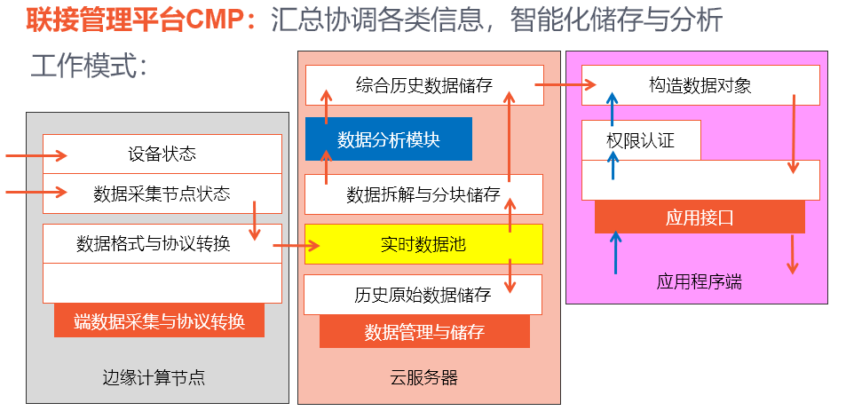

# Iot-CMP
小微工业企业云端智能解决方案-联接管理平台CMP

V1.0 支持Modbus协议设备接入 2020-10-23  
V1.1 蒸压釜设备应用开发完成 2020-10-31

运行说明：
入口：server.py   
（参数0：定时运行，1：单次运行，2：运行测试程序）

启动服务进程：  
1, 运行自启动脚本 "/home/Iot-CMP/autoRestart.sh"  
2, "crontab -e" 进入crontab编辑器后，设置定时指令（9分钟）
"*/9 * * * * /home/Iot-CMP/autoRestart.sh"

终止服务进程：  
1, "crontab -e" 进入crontab编辑器后，注释或删除定时指令。  
2， ps -a 查看当前进程，kill掉python3进程

